# DPE-Energy-Performance-Analysis

[](https://github.com/fereol023/DPE-Energy-Performance-Analysis-API/actions/workflows/github-volt-api-cd.yml) 
[](https://github.com/fereol023/DPE-Energy-Performance-Analysis-API/actions/workflows/github-volt-api-ci.yml) 
[](https://github.com/fereol023/DPE-Energy-Performance-Analysis-ETL/blob/main/.github/workflows/github-volt-engine-ci.yml) 
[](https://test.pypi.org/project/volt-etl-engine/) 
[](https://github.com/fereol023/DPE-Energy-Performance-Analysis-ClientApp/actions/workflows/github-cd.yml) 
[](https://github.com/fereol023/DPE-Energy-Performance-Analysis-ClientApp/actions/workflows/github-ci.yml)

### Dernière mise à jour : 08/09/2025

## 📑 Sommaire 
1. [Description du projet](#description-du-projet)  
2. [Architecture et sécurité](#architecture-et-sécurité) 
3. [Pré-requis](#pré-requis)  
4. [Configuration](#configuration)
5. [Monitoring](#monitoring)
5. [Lancer le SI](#lancer-le-si)  
6. [Utilisation](#utilisation)  
7. [Authentification et rôles](#authentification-et-rôles)  
8. [Contact](#contact)
9. [Contribution](#contribution)


## Description du projet

Cette partie présente la description fonctionnelle, technique et le cadre de réalisation du projet. 

### Description fonctionnelle

Le Diagnostic de Performance Energétique (DPE) sert de document de référence pour : 
* évaluer la consommation d'énergie d'un bâtiment/logement (étiquette énergie)
* évaluer les émissions de gaz à effet de serre (étiquette GES).

Depuis son introduction en 2006, la méthode de calcul n'a cessé d'être réévaluée pour coller au plus près à la réalité et fait constamment l'objet d'étude scientifiques. Ces études se basent toutes sur des échantillons de données et tombent toutes d'accord sur le fait que malgré les efforts réalisés, le **DPE a tendance à sur évaluer les consommations énergétique des logements**.

Toutefois, ces études sont ponctuelles et réalisées chaque fois sur des échantillons de logement. Il en est ainsi en raison du **challenge technique que représente l'exploitation des données volumineuses** sur tous les logements français (plus de 12 millions). En effet, les données utilisées sont celles de [Enedis](https://data.enedis.fr/explore/dataset/consommation-annuelle-residentielle-par-adresse/table/?refine.annee=2023&dataChart=eyJxdWVyaWVzIjpbeyJjaGFydHMiOlt7ImFsaWduTW9udGgiOnRydWUsInR5cGUiOiJhcmVhIiwiZnVuYyI6IkNPVU5UIiwieUF4aXMiOiJub21icmVfZGVfbG9nZW1lbnRzIiwic2NpZW50aWZpY0Rpc3BsYXkiOnRydWUsImNvbG9yIjoiIzE0MjNEQyJ9XSwieEF4aXMiOiJjb2RlX2RlcGFydGVtZW50IiwibWF4cG9pbnRzIjoyMDAsInRpbWVzY2FsZSI6IiIsInNvcnQiOiJzZXJpZTEtMSIsImNvbmZpZyI6eyJkYXRhc2V0IjoiY29uc29tbWF0aW9uLWFubnVlbGxlLXJlc2lkZW50aWVsbGUtcGFyLWFkcmVzc2UiLCJvcHRpb25zIjp7InJlZmluZS5hbm5lZSI6IjIwMjMifX0sInNlcmllc0JyZWFrZG93blRpbWVzY2FsZSI6IiIsInNlcmllc0JyZWFrZG93biI6IiJ9XSwiZGlzcGxheUxlZ2VuZCI6dHJ1ZSwiYWxpZ25Nb250aCI6dHJ1ZSwidGltZXNjYWxlIjoiIn0%3D), l'[Ademe](https://data.ademe.fr/datasets/dpe03existant/full) et la [BAN](https://geoservices.ign.fr/documentation/services/services-geoplateforme/geocodage#70974).

Ce projet vient apporter une solution pratique à ce problème en développant une infrastructure ETL open source capable de collecter et de traiter les données volumineuses à l'échelle nationale disponibles (consommations Enedis, DPE ADEME, caractéristiques des logements) pour :

* Quantifier les écarts entre estimations DPE et consommations réelles mesurées par Enedis
* Mesurer la part de variabilité non expliquée par les caractéristiques des logements
* Apporter une aide à la décision pour les travaux de rénovation en prédisant les gains de performance énergétique selon le profil du logement.

### Description technique 

Il s'agit d'un système d'information client/serveur où le serveur est organisé en microservices. L'objectif est d'analyser, comparer et prédire et expliquer la consommation énergétique des logements français. Le serveur exécute la charge de travail (pipelines de données, stockage, sécurité) et communique les données à l'application cliente pour l'analyse via une API rest.

**Les composantes du SI ont été pensés pour être ré-utilisables en standalone ou avec intégration afin de faciliter un maximum la prise en main du sujet par les chercheurs**. En suivant les instructions de ce guide vous aurez un jeu de données constamment à jour et exploitable et vous n'aurez plus qu'à vous concentrer sur la modélisation et l'analyse des résultats 📊 🙂.

### Cadre de réalisation

Ce projet est réalisé dans le cadre du challenge [OpenData University - DPE - saison 24/25](https://defis.data.gouv.fr/defis/diagnostics-de-performance-energetique). Il est également présenté et soutenu dans le cadre de la certification [RNCP Ingénieur en Science des Données 2025](https://www.francecompetences.fr/recherche/rncp/39586/).


## Architecture et sécurité 

#### Architecture du SI

Le schéma ci-dessous présnete l'architecure globale du SI. L'infra est composée de l'app client et du serveur. Le point d'entrée du serveur est l'API Rest qui interface avec les autres micro service du serveur et sert de data access layer. L'API Rest encapsule également l'application ETL. En effet une chaque instance de l'API rest démarre un agent prefect dans un thread séparé à l'initialisation. Ce moteur ETL est utilisé par le serveur prefect pour exéuter la charge de travail lors du déploiement. Les autres microservices du serveur sont : 
* S3 Object Storage : représenté par une instance MinIO mais interfacable avec AWS S3 grâce à boto3
* seveur Prefect : nécéssaire pour l'ETL et le monitoring via son UI
* caching service Redis : utilisé pour l'authentification avec les OTP 
* Postgres : utilisé pour la persistance des données à la sortie de l'ETL 
* Prometheus, Grafana : utilisés pour surveiller les temps d'exécution des donctions et profiler l'API
* Traefik : sert de load balancer lorsqu'on exécute le serveur avec plusieurs instances de l'API rest. 

<p align="center">
<u>Figure:</u> Vue simplifiée de l'architecture du SI
<p align="center">
 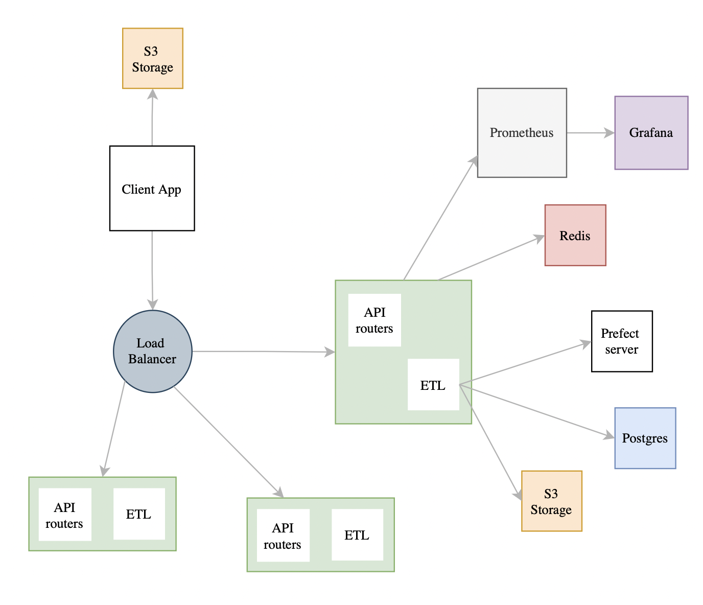
</p>

Le schéma suivant montre une vue globale des flux de données échangés entre les micro services d'une part et entre le serveur et le client de l'autre.

<p align="center">
<u>Figure:</u> Vue globale des flux de données échangées
<p align="center">
  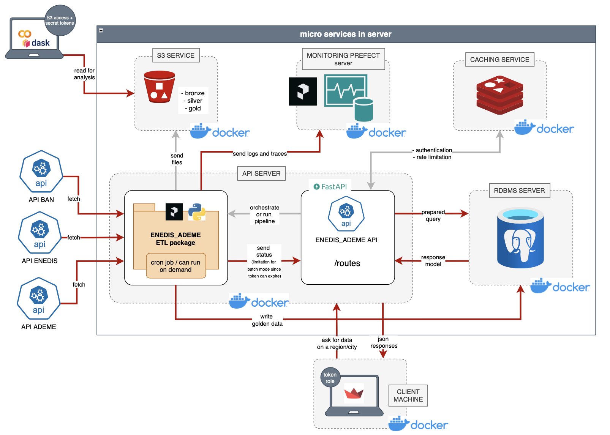
</p>

#### CI/CD
Les repos gitmodules utilisent des pipelines CI/CD centralisés dans le dossier [pipelines-templates](pipelines_templates/).

<p align="center">
  
</p>

#### Sécurité
La sécurité est gérée par l'API coté serveur. Pour récupérer de la donnée, il faut être authentifié au moins comme `READER`. L'autre niveau d'authentification est `ADMIN` qui permet d'avoir accès à d'autres routes de l'API y compris celles permettant de déployer l'ETL ou d'envoyer des mails à la base d'utilisateurs. Pour s'authentifier, il faut disposer d'une adresse mail valide sur laquelle un OTP est envoyé. Cet OTP permet d'avoir une session de connexion de quelques heures (paramétrable par l'admin).


## Pré-requis

- Python 3.12
- Docker desktop
- Compte DockerHub
- Compte AWS (optionnel)

## Configuration 

* Option 1 : Configuration low code et rapide (recommandée)

Commencer par cloner ce repos git avec la commande : 
```
git clone https://github.com/fereol023/DPE-Energy-Performance-Analysis.git
```

Ensuite définir les variables d'environnement suivantes dans un fichier `.env` à la racine du projet. Voir le [fichier exemple](exemple.env)
```
ENV="NOLOCAL"
POSTGRES_DB_NAME="dpedb_v2"
POSTGRES_ADMIN_USERNAME="postgres"
POSTGRES_ADMIN_PASSWORD="password"
POSTGRES_READER_USERNAME="reader"
POSTGRES_READER_PASSWORD="reader_password"
POSTGRES_WRITER_USERNAME="writer"
POSTGRES_WRITER_PASSWORD="writer_password"
S3_ACCESS_KEY="minio-access-key"
S3_SECRET_KEY="minio-secret-key"
S3_BUCKET_NAME="dpe-storage-v1"
MINIO_ROOT_USER="minio"
MINIO_ROOT_PASSWORD="password"
SMTP_USERNAME="google-email-that-will-sent-mails@gmail.com"
SMTP_PASSWORD="code-got-from-google"
ADMIN_EMAIL="any-admin-email-to-auth-as-admin-in-client-app"
AWS_S3_STREAMLIT_ACCESS_KEY="optional-aws-s3-access-key"
AWS_S3_STREAMLIT_SECRET_KEY="optional-aws-s3-secret-key"
AWS_S3_STREAMLIT_BUCKET_NAME="dpe-storage-aws-v1"
GRAFANA_ADMIN_USER="admin"
GRAFANA_ADMIN_PASSWORD="adminpwd"
VERSION_DASHBORD="v0.10.0.1756027620" 
VERSION_API="v0.19.0.1756058671"
```

Pour les versions de l'API et du dashboard, consultez les pages dockerhub : 
- [Image docker server](https://hub.docker.com/repository/docker/fereol023/dpe-energy-performance-analysis-clientapp) 
- [Image docker client](https://hub.docker.com/repository/docker/fereol023/dpe-energy-performance-analysis-api)

## Monitoring 

Pour monitorer le SI, on implémente plusieurs solutions : 
- **mailing de l'état des micro services** fait après pring par l'API Gateway : 

Utilise le même module de mailing que le SSO basé sur le serveur [**SMTP de gmail (procédure ici)**](https://www.hostinger.com/fr/tutoriels/utiliser-serveur-smtp-gmail).
- monitoring via **Prefect UI** pour l'ETL et les logs
- monitoring de l'API elle même via **Prometheus + Grafana**

Ceci est possible grâce au client prometheus qui est utilisé dans l'API. Pour configurer le collecteur de métrqiues prometheus, il faut mettre dans un bind mount le fichier de fichier de config suivant. A mettre dans `/DPE-Energy-Performance-Analysis-API/storage/prometheus/prometheus.yml` car les docker compose files sont configurés ainsi (voir volume prometheus).
````
global:
  scrape_interval: 5s

scrape_configs:
  - job_name: "api-functions-profiling"
    metrics_path: /profiling
    static_configs:
      - targets: ["api:8000"]

  - job_name: "api-system-metrics"
    metrics_path: /metrics
    static_configs:
      - targets: ["api:8000"]
````


* Option 2 : Configuration en partant de la code base

Cloner le projet avec la commande. Clonera également tous les sous modules git 
````
git clone --recursive https://github.com/fereol023/DPE-Energy-Performance-Analysis.git
````
Ensuite pour chacun des modules client et serveur, créer un venv et exécuter la commande : 
````
pip install -r requirements.txt
````

## Lancer le SI 

Vous l'aurez remarqué on a 3 fichiers docker-compose dans ce repos. Les deux premiers [.dev](docker-compose.dev.yml) et [.prod](docker-compose.prod.yml) sont respectivement utilisés pour exécuter la stack complète avec docker compose. Le dernier [.local](docker-compose.local.yml) est utilisé pour déployer les micro services utilisés par le serveur uniquement. Ceci est pratique pour lancer le SI avec l'option 2 (cloner la code base et décortiquer le code).

* Option 1

Exécuter l'une des commande suivantes pour déployer la stack dans la config 1. 

<p align=center>-- déploiement basique --</p>

```
docker compose -f docker-compose.dev.yml --env-file .env up -d --build
```
<p align=center>-- déploiement avec k replicats de l'api --</p>

````
docker compose -f docker-compose.dev.yml --env-file .env up --scale api=k -d
````
<p align=center>-- déploiement avec docker swarm (reproduire le fonctionement des clusters k8s) --</p>

````
docker swarm init
docker stack deploy -c docker-compose.prod.yml dpe
docker service scale dpe_api=3
````

* Option 2 : 

Lancer le serveur API et le client avec les commandes 
````
# api
python3 main.py --local

# client app
streamlit run app.py --server.port=8501
````

## Utilisation
La documentation interactive du serveur est accessble sur le port 8000 de votre machine. L'interface dashboard analytique est disponible sur le port 8501.

L'interface client est une app streamlit multipages (3 pages). La première est la page de connexion. Obligatoire pour s'authetifier et utiliser l'app. Permet de s'authentifier soit en tant qu'admin ou en tant que lecteur simple.

<p align="center">
<u>Figure:</u> Page de connexion sur l'app client
<p align="center">
  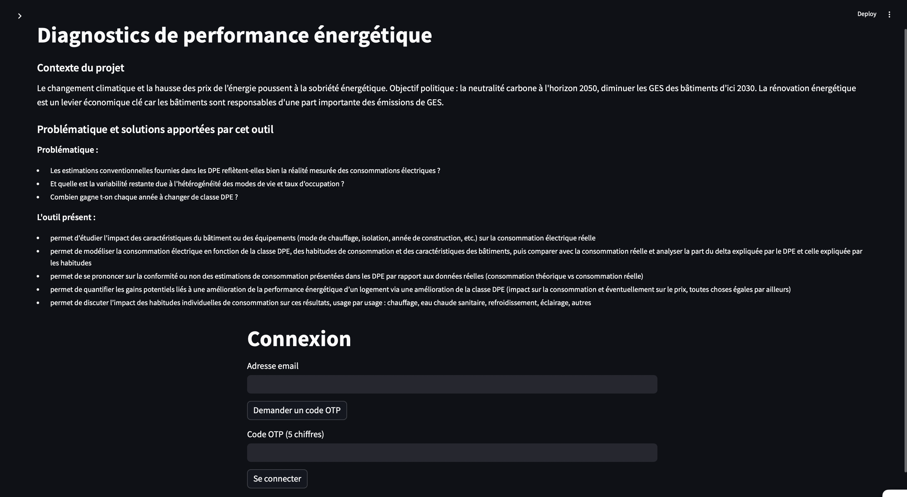
</p>

La deuxième page présente les graphiques. 

<p align="center">
<u>Figure:</u> dataviz 1
<p align="center">
  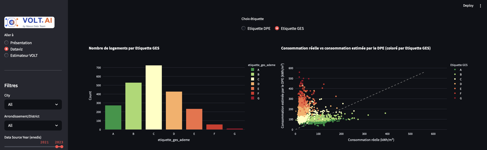
</p>

<p align="center">
<u>Figure:</u> dataviz 2
<p align="center">
  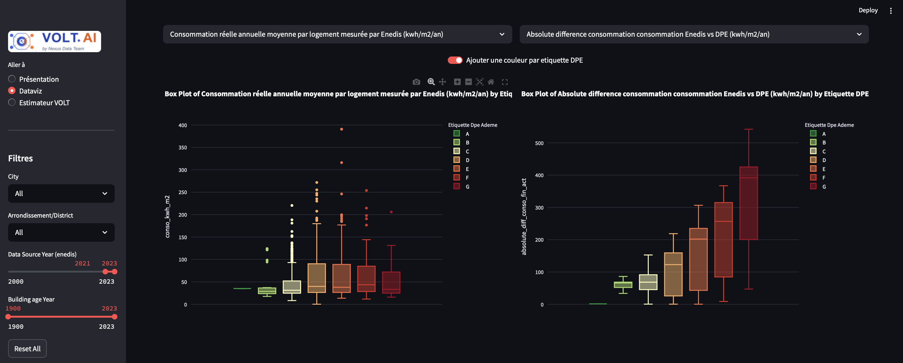
</p>

La troisième page, encapsule un modèle IA qui permet de prédire les éconopmies réalisables en engageant des travaux pour changer de classe DPE.


Pour obtenir ce modèle [random forest](https://scikit-learn.org/stable/modules/generated/sklearn.ensemble.RandomForestRegressor.html) nous avons réalisé une étude visant à comprendre les **facteurs explicatifs de la consommation énergétique des bâtiments** sur la base des variables dont on disposait. Ces 220 variables portaient sur les caractérisiques des logements et sont obtenues via le pipeline d'ETL à l'étape silver data. Le résultat de l'anayse de données est présentée dans [ce rapport](docs/GBENOU_FEREOL_Dossier%20BLOC2_DATAENG.pdf).

L'image suivante présente les performances du modèle en apprentissage-validation. 
<p align="center">
<u>Figure:</u> Métriques modele rf-oise-2023
<p align="center">
  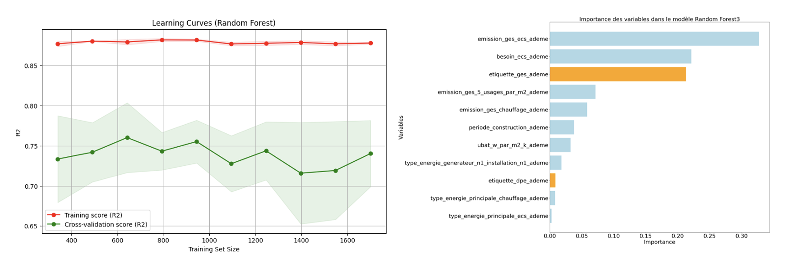
</p>

Et enfin, les images suivante présntent un ensemble d'inputs et un exemple d'output (matrice de gain): 

<p align="center">
<u>Figure:</u>variables inputs du modèle 
<p align="center">
  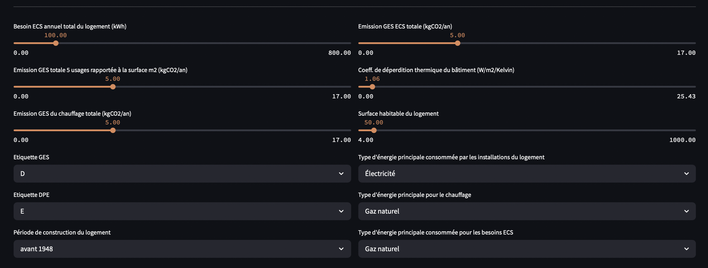
</p>

<p align="center">
<u>Figure:</u>matrice de gains 
<p align="center">
  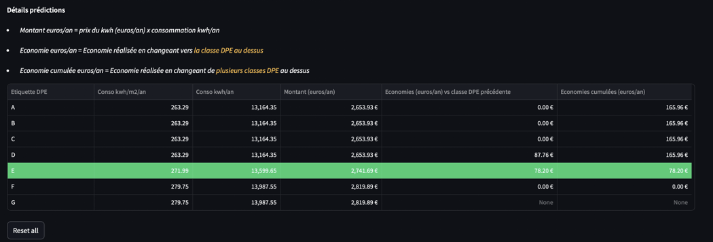
</p>

Pour le serveur, la documentation interactive est accessible via le swagger.
<p align="center">
<u>Figure:</u> swagger UI
<p align="center">
  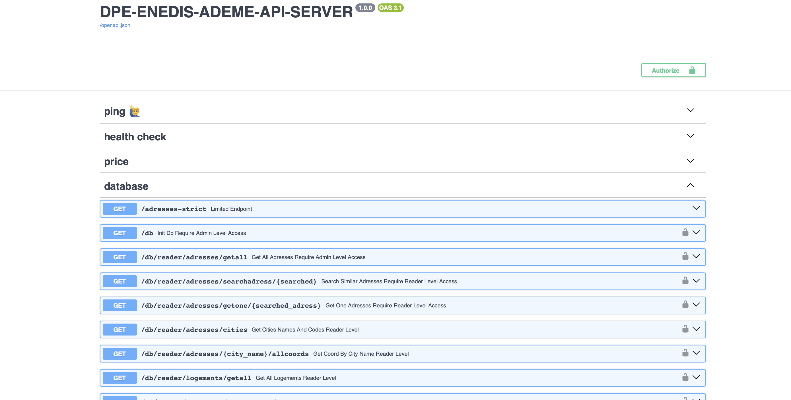
</p>

Pour plus d'information sur l'utilisation de l'app cliente, un [support de formation est disponible ici](docs/Support%20de%20formation%20-%20dashboard%20analytique.pdf)

#### Utilisation - monitoring

<p align="center">
<u>Figure:</u> Panel admin dans l'app
<p align="center">
  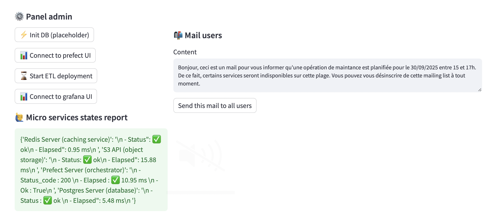
</p>

Etant connecté en tant qu'administatrateur dans l'app client, les solutions de monitoring énumérées ci-dessus sont toutes accessibles sur la première page. Plus précisément, lorsque l'admin se connecte : 
- il reçoit un état global du SI par mail avec messages d'erreur si erreur il y a.

<p align="center">
<u>Figure:</u> SI Global State Report to Admin
<p align="center">
  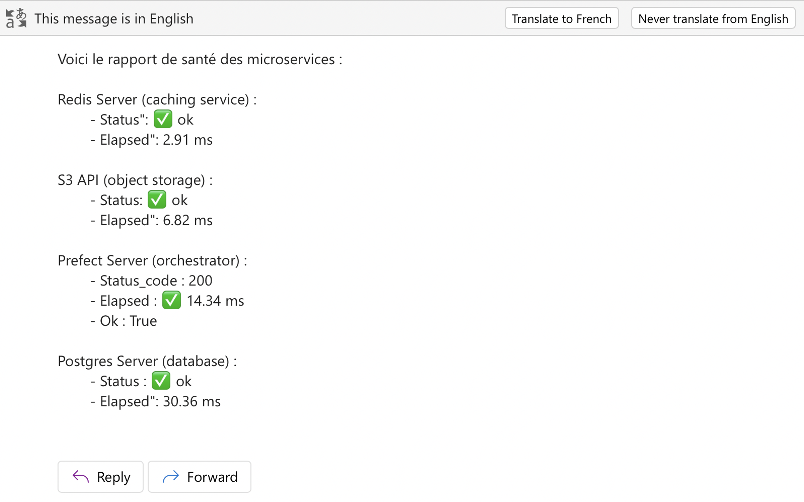
</p>

- il peut accéder à l'UI prefect sur le `server:4200`

<p align="center">
<u>Figure:</u> Prefect UI
<p align="center">
  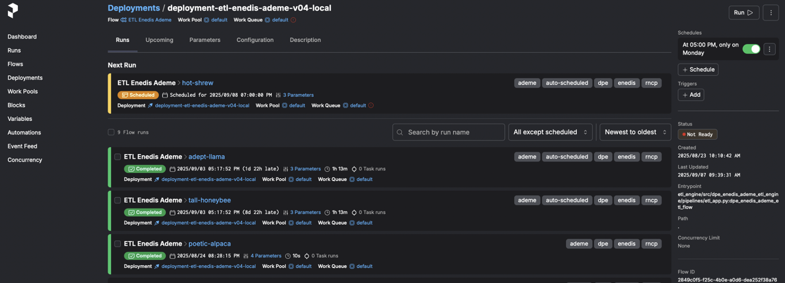
</p>

- il peut accéder au dashboard grafana pour voir **les métriques CPU, RAM etc** de l'API et le profiling de toutes les fonctions utilisées sur le `serveur:3000`

<p align="center">
<u>Figure:</u> Dashboard Grafana Monitoring
<p align="center">
  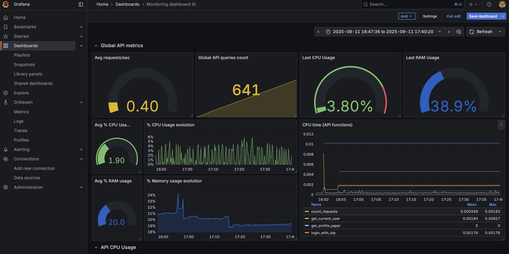
</p>

## Authentification et rôles

Pour les mesures de sécurité, on implemente un système d'authentification SSO avec oAuth2 basé sur 2 rôles `ADMIN` et `READER`. Ces rôles sont crées au niveau de l'API. En effet, pour utiliser les endpoints database, l'utilisateur doit s'authentifier. L'authentification consiste à envoyer un OTP sur l'adresse mail renseignée. L'utilisateur doit alors consulter ses mails et saisir l'OTP recu. Ceci donne doit à une session de quelques heures. Si l'email utilisé est celui de l'admin, l'utilisateur est authentifié en tant que tel et peut avoir accès au panel admin qui permet de faire plusieurs choses entre autres : 
- exécuter le déploiment de l'ETL
- exécuter l'ETL en targettant un département
- accéder au tableau de bord de monitoring avec Prefect et Grafana

<p align="center">
  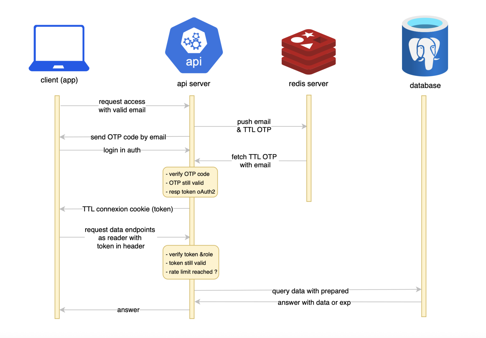
</p>
<p align="center">
<u>Figure:</u> Authentification

## Contribution 
- Le schéma ci-dessous récapitule le fonctionnement du **gitflow** reproduit partout dans le projet avec les pipelines de CI/CD 

<p align="center">
  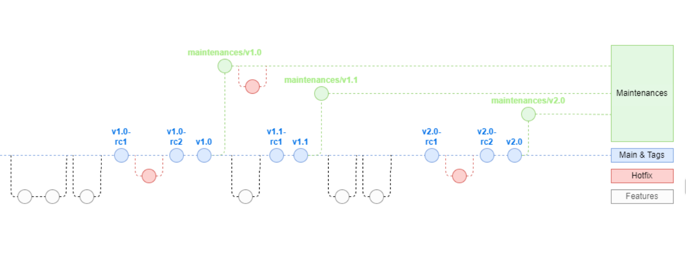
</p>
<p align="center">
<u>Figure:</u> Gitflow


- Pour toute contribution, vous êtes libre de forker ce repos ou celui d'un des modules en respectant les licences.
- Vous pouvez également contribuer à l'évolution du projet en ajoutant des US dans le [github project ici](https://github.com/users/fereol023/projects/1).

## Contact 
- E-mail : fereol.gbenou@ynov.com
- Page pro : [LinkedIn](https://www.linkedin.com/in/fereol-gbenou/)